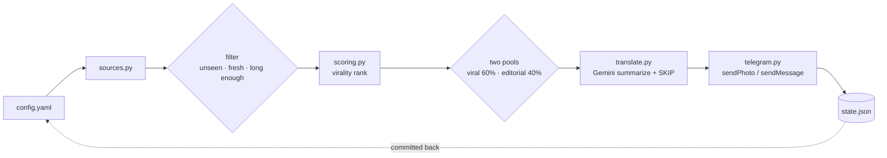

<div align="center">

# Persian Tech Tube Bot

**A Telegram news bot that ranks tech, cybersecurity, and AI stories by virality and posts Persian summaries. Runs free on GitHub Actions.**

[](https://www.python.org/)
[](LICENSE)
[](.github/workflows/publish.yml)
[](https://t.me/persiantechtwiter)
[](#what-it-costs)

[Live channel](https://t.me/persiantechtwiter) · [The algorithm](#how-the-ranking-algorithm-works) · [Quickstart](#quickstart) · [Sources](#news-sources)

</div>

---

Persian Tech Tube Bot aggregates technology and cybersecurity news from Hacker News, Lobsters, Bluesky, and fourteen RSS feeds, then publishes the best of it to a Telegram channel in Persian. It ranks stories with a virality algorithm built from Hacker News gravity decay, Reddit's logarithmic damping, and engagement velocity measured against each source's own median. Google Gemini's free tier writes the Farsi summaries. There is no server and no database: GitHub Actions cron runs it, and a committed `state.json` remembers what already went out.

## What it does

Every thirty minutes the bot reads its sources, scores everything it found, and posts the single best item as a Persian summary with an image and link buttons. One post per run is deliberate: batching three posts meant they arrived twelve seconds apart and then the channel went quiet for half an hour. At this cadence the channel gets up to 48 posts a day and in practice around 40, split evenly between social posts and news articles. Total cost is zero. Bluesky's API is open, Gemini has a free tier, and GitHub Actions gives public repositories unlimited minutes.



## How the ranking algorithm works

The problem is picking a handful of stories per run out of a few hundred candidates. Sorting by raw popularity buries anything published in the last hour, and sorting by recency posts noise. The algorithm blends three published approaches to get around that.

### Hacker News gravity decay

Hacker News ranks with `(P-1) / (T+2)^1.8`, where `P` is points and `T` is hours since submission. Because the exponent on time is larger than the exponent on points, nothing stays on top forever. This bot reuses the same gravity constant of 1.8.

### Reddit logarithmic damping

Reddit's "hot" formula applies `log10` to the vote count, so the first ten votes move a story as much as the next hundred do. Without it, one post with five thousand likes would smother everything else for the rest of the day.

### Engagement velocity against a baseline

Research on viral detection points at the rate of engagement accumulation in the first hour as the strongest predictor of reach, and says it has to be measured against a baseline rather than an absolute number. A 500-follower account pulling 50 likes is genuinely hotter than a 500,000-follower account pulling 200.

### The formula

```
engagement = 1×likes + 3×reposts + 3×quotes + 2×replies      (social sources)
           = 1×points + 2×comments                            (link aggregators)

quality    = log10(1 + engagement)
velocity   = engagement / (age_hours + 0.5)
baseline   = median velocity of that same source, this run
ratio      = velocity / baseline

score      = quality × (1 + log10(1 + ratio)) / (age_hours + 2)^1.8
```

Two decisions are worth calling out.

Reposts and quotes count triple because resharing is what actually spreads a story. A like is passive consumption and says much less about whether something will travel.

`baseline` is the median velocity of that same source within the same run, which means there are no hand-tuned constants anywhere in the scoring. Every source calibrates itself on every run, and a source that gets more or less popular over time recalibrates without anyone editing a config file.

### A worked example

Three real Hacker News stories from one run, where the source median velocity was 51.6:

| Story | Engagement | Age | Velocity | Ratio | Quality | Score |
|---|---:|---:|---:|---:|---:|---:|
| Fresh, rising fast | 96 | 1.5 h | 48.0 | 0.93 | 1.99 | **0.2679** |
| More total engagement | 148 | 2.1 h | 56.9 | 1.10 | 2.17 | 0.2268 |
| The day's biggest story | 530 | 6.8 h | 72.6 | 1.41 | 2.73 | 0.0751 |

The third story has five times the engagement of the first and still loses by a wide margin, because at 6.8 hours old it has already been seen by anyone who was going to see it. The first story wins on being 1.5 hours old and climbing.

## Two-pool design

Only some sources publish engagement numbers. RSS feeds publish none at all. Rather than invent a fake vote count for news articles so they could share one leaderboard, items go into two pools that never compete on the same scale.

| Pool | Sources | Ranked by | Share |
|---|---|---|---|
| Viral | Hacker News, Lobsters, Bluesky | The full score above | `viral_share`, default 0.5 |
| Editorial | RSS news feeds | Source authority ÷ time decay | The remainder |

Because a run posts only one item, the split cannot happen inside a run: `ceil(1 × 0.5)` is 1, and the editorial pool would never get a turn. The ratio is kept over time instead. Each run takes from whichever pool is behind its share according to running totals in `state.json`, which produces an interleaved sequence rather than clumps:

```
V E V E V E V E V E   →   5 viral, 5 editorial
```

If the pool that is due happens to be empty, the other one takes the slot, so a quiet weekend on Hacker News means more room for news feeds instead of a half-empty run.

## News sources

Sources with engagement data, which get virality scores:

| Source | API | Notes |
|---|---|---|
| Hacker News | Algolia `search_by_date` | `min_points` threshold, default 50 |
| Lobsters | `hottest.json` | Small community, so `min_engagement` guards it |
| Bluesky | Public XRPC API | No auth needed, returns likes, reposts, quotes, replies |

Security and hacking:

| Source | Authority |
|---|---:|
| [Krebs on Security](https://krebsonsecurity.com/) | 0.95 |
| [The Hacker News](https://thehackernews.com/) | 0.90 |
| [BleepingComputer](https://www.bleepingcomputer.com/) | 0.90 |
| [The Record](https://therecord.media/) | 0.80 |
| [Dark Reading](https://www.darkreading.com/) | 0.75 |

Artificial intelligence:

| Source | Authority |
|---|---:|
| [OpenAI](https://openai.com/news/) | 0.90 |
| [Google AI](https://blog.google/technology/ai/) | 0.85 |
| [TechCrunch AI](https://techcrunch.com/category/artificial-intelligence/) | 0.80 |
| [Hugging Face](https://huggingface.co/blog) | 0.70 |
| [VentureBeat AI](https://venturebeat.com/category/ai/) | 0.70 |

General technology:

| Source | Authority |
|---|---:|
| [Ars Technica](https://arstechnica.com/) | 0.85 |
| [MIT Technology Review](https://www.technologyreview.com/) | 0.80 |

Twitter and X accounts work through [xcancel.com](https://xcancel.com) RSS bridges. There is a commented example in `config.yaml`. Nitter instances die every few months, so treat that URL as something you will replace occasionally.

## Other things it does

Images come from Bluesky embeds, RSS media tags, or the article's `og:image`, and go out through `sendPhoto`. If Telegram rejects an image the post falls back to text instead of being dropped.

Each post carries inline buttons: the source article, and the Hacker News or Lobsters discussion when there is one. Both are `url` buttons rather than `callback_data`, which matters because a `url` button needs no running backend. A callback button would require something alive to answer it, and this bot only exists for the sixty seconds a cron job takes.

Gemini doubles as an editorial filter. The prompt tells it to answer `SKIP` for anything that is not about technology, is promotional, or is otherwise not worth a post, which is how entertainment stories and discount codes get caught before they reach the channel.

Every source is fetched inside its own try block. A dead feed logs a warning and the run continues.

Failed translations do not mark an item as seen, so the next run retries it. Gemini's free tier returns 429 and 503 often enough that the client also retries with exponential backoff.

## Quickstart

```bash
git clone https://github.com/morpheusadam/persian-tech-tube-bot.git
cd persian-tech-tube-bot

python -m venv .venv
.venv/bin/pip install -r requirements.txt     # Windows: .venv\Scripts\pip.exe

cp .env.example .env                          # then fill in the three values
.venv/bin/python -m src.main --dry-run --explain
```

`--dry-run` sends nothing and does not write state. `--explain` prints the scoring table so you can see what the algorithm picked and why. Without a `GEMINI_API_KEY` the dry run still works and shows the original English text.

You need a bot token from [@BotFather](https://t.me/BotFather), a channel with that bot added as an administrator with Post Messages permission, and a Gemini key from [Google AI Studio](https://aistudio.google.com/apikey).

### Deploying to GitHub Actions

Push to a public repository, then add three secrets under Settings, Secrets and variables, Actions:

| Secret | Value |
|---|---|
| `TELEGRAM_BOT_TOKEN` | Token from BotFather |
| `TELEGRAM_CHANNEL` | Channel username, for example `@persiantechtwiter` |
| `GEMINI_API_KEY` | Key from Google AI Studio |

Run the `publish` workflow once by hand to check it, and the thirty minute cron takes over after that. GitHub does not fire scheduled workflows punctually, and delays of five to twenty minutes are normal on busy public runners. That shifts when a post arrives but not which post wins, because scoring uses each item's real age rather than the time the job happened to start. The workflow commits `state.json` back to the repository, which is why it needs `contents: write`.

## Configuration

Everything except the three secrets lives in [`config.yaml`](config.yaml).

| Setting | Default | What it controls |
|---|---:|---|
| `max_posts_per_run` | 1 | Posts per run. Keeping it at 1 is what makes the pacing even. |
| `viral_share` | 0.5 | Long-run fraction of posts taken from engagement-ranked sources |
| `max_age_hours` | 12 | Age cutoff for the viral pool |
| `editorial_max_age_hours` | 48 | Age cutoff for news feeds, which go quiet on weekends |
| `seconds_between_posts` | 4 | Spacing to stay under Telegram rate limits |
| `min_text_length` | 80 | Below this, an RSS item is usually an empty headline |
| `min_ranked_text_length` | 30 | Lower, because engagement already proves the item |
| `fetch_og_image` | true | Scrape `og:image` when a feed gives no picture |
| `gemini_model` | `gemini-2.5-flash` | Any Gemini model id |

Per source you can set `label`, plus `authority` for RSS feeds, `min_engagement` for the viral pool, and `min_points` for Hacker News.

The Gemini free tier sets the ceiling on all of this. Each item costs one request, including ones the model answers `SKIP` to, and `gemini-2.5-flash` allows roughly 250 requests a day. A thirty minute cron is 48 runs, so one post per run costs at most 48 requests a day. Keep `runs_per_day × max_posts_per_run` under 250, or switch to `gemini-2.5-flash-lite`, which allows about 1000 requests a day but writes weaker Persian.

## Why some obvious sources are missing

**Reddit** returns HTTP 403 to datacenter IP addresses. It fails from GitHub Actions runners, so there is no point adding it.

**The X API** no longer sells read access on its free tier. Reading tweets starts at a few hundred dollars a month, which is why this project goes through xcancel RSS instead.

**Telegram Serverless** does run bot code on Telegram's own infrastructure for free, and it is a good fit for bots that answer users. It is not a fit here: it only executes in response to Bot API updates, and there is no cron, timer, or delayed execution primitive. Nothing would ever wake this bot up, since nobody sends it messages.

## Project layout

```
src/
  main.py        orchestration, filtering, pool quotas, CLI
  sources.py     fetchers for Bluesky, Hacker News, Lobsters, RSS
  scoring.py     the virality algorithm
  translate.py   Gemini summarization and the SKIP filter
  telegram.py    sendPhoto and sendMessage
  state.py       seen-item tracking
  models.py      the Item dataclass
config.yaml      sources and tuning
state.json       written by the bot, committed by the workflow
.github/workflows/publish.yml
```

Dependencies are `httpx`, `feedparser`, and `PyYAML`. Nothing else.

## What it costs

| Component | Cost |
|---|---|
| Bluesky API | Free, open, no auth |
| Hacker News Algolia API | Free |
| Lobsters JSON | Free |
| Google Gemini | Free tier, about 250 requests a day |
| GitHub Actions | Free, unlimited minutes on public repos |
| Telegram Bot API | Free |

## A note on copyright

The bot posts a summary of a few sentences with a link back to the source, which is ordinary quotation. If you modify it to republish full articles, that is a different situation and not one this project is set up for.

## License

MIT. See [LICENSE](LICENSE).
